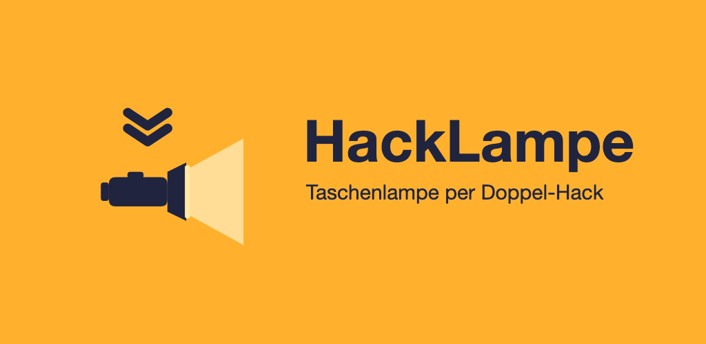
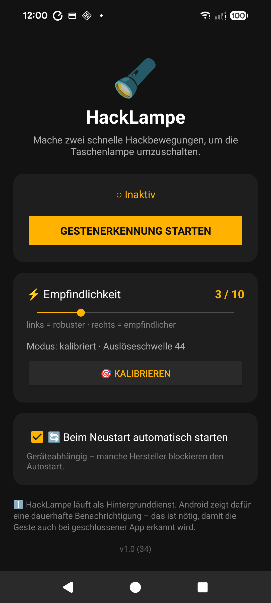
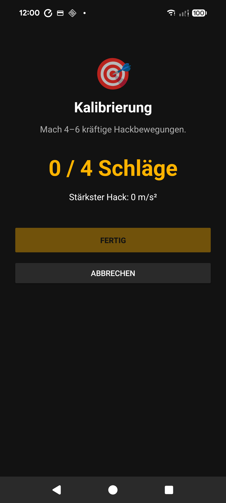

# HackLampe (Chop'n'Light)



Retrofit the Motorola-style **"chop chop"** gesture onto any Android phone: make two
quick chopping (karate-chop) motions and your **flashlight toggles on/off** — even
when the app is closed.

---

## Features

- 🔦 **Double-chop to toggle the flashlight** — works in the background, even with the app closed.
- ⚡ **Quick Settings tile** to enable/disable gesture detection from the notification shade.
- 🎯 **Auto-calibration wizard** — measures your personal chop strength and sets the detection thresholds automatically.
- 🎚️ **Sensitivity slider** — fine-tune detection; when calibrated it works *relative* to your calibration (level 5 = calibrated value).
- 🔄 **Optional auto-start** after reboot.
- 🔒 **Fully offline** — no internet permission, no accounts, no tracking, no ads, collects no data.
- 🌍 **6 languages** — English (default), German, Spanish, French, Italian, Turkish.
- 🪶 Tiny (~0.9 MB), Android 12+.

## Screenshots

| Settings | Calibration |
|---|---|
|  |  |

## How it works

Detecting a quick gesture while the app is closed requires continuously reading the
accelerometer, which on modern Android is only possible from a **foreground service**
with a persistent notification (this is an OS requirement, not a design choice).

- **`GestureService`** — a foreground service (type `specialUse`) that reads the
  accelerometer and toggles the torch via `CameraManager.setTorchMode()` (no camera
  permission needed).
- **`GravityFilter`** — a high-pass filter that removes gravity from the raw
  accelerometer to obtain linear acceleration. This replaces the virtual
  `TYPE_LINEAR_ACCELERATION` sensor, which is unreliable on some budget/MTK devices
  where sensor fusion is disabled.
- **`ChopDetector`** — a pure-Kotlin Schmitt-trigger peak counter: a "chop" is a peak
  above an upper threshold; the detector re-arms only after the signal drops below a
  lower (valley) threshold. Two chops within a time window = a double-chop. This
  cleanly separates a single hard chop from a deliberate double-chop. Fully unit-tested.
- **`CalibrationAnalyzer`** — measures the peaks of a few sample chops and derives the
  thresholds, so detection adapts to the user and the device.

## Build from source

Requires JDK 17 and the Android SDK (platform 35, build-tools 35).

```bash
# Debug APK
./gradlew assembleDebug
# → app/build/outputs/apk/debug/app-debug.apk

# Run unit tests (ChopDetector, CalibrationAnalyzer, GravityFilter)
./gradlew test
```

**Release builds** are signed via a gitignored `keystore.properties` (not in the repo).
To build a signed release/bundle, create `keystore.properties` next to `settings.gradle.kts`:

```properties
storeFile=hacklampe-release.jks
storePassword=...
keyAlias=...
keyPassword=...
```

```bash
./gradlew assembleRelease   # signed APK (sideloading)
./gradlew bundleRelease     # signed AAB (Play Store upload)
```

`versionCode` is derived automatically from the git commit count.

## Project structure

```
app/src/main/kotlin/de/hacklampe/app/
  detector/ChopDetector.kt        double-chop detection (pure logic, tested)
  detector/CalibrationAnalyzer.kt threshold calibration (pure logic, tested)
  detector/GravityFilter.kt       gravity removal / linear acceleration (tested)
  service/GestureService.kt       foreground service: sensor → detector → torch
  torch/TorchController.kt        flashlight wrapper
  tile/HackTile.kt                Quick Settings tile
  ui/SettingsActivity.kt          settings screen
  ui/CalibrationActivity.kt       calibration wizard
  boot/BootReceiver.kt            optional auto-start after reboot
  data/Prefs.kt                   settings storage
docs/                             privacy policy, store listing, assets
```

## Privacy

HackLampe collects no data and has no internet access. See the
[privacy policy](https://v3nomsoup.github.io/hacklampe/).

## Disclaimer

HackLampe is an independent, unofficial app and is **not affiliated with, endorsed by,
or sponsored by Motorola or Lenovo**. "Motorola" is a trademark of its respective owners
and is referenced only to describe a similar gesture.

## Tech

Kotlin · Android SDK (minSdk 31 / target 35) · Gradle (Kotlin DSL) · JUnit4

---

🤖 Built with [Claude Code](https://claude.com/claude-code).
